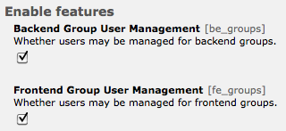

.. include:: ../Includes.rst.txt
.. _configuration:

Configuration
=============

This extension provides configuration within Admin Tools > Settings:

This lets you easily activate the user management for ``be_groups`` and ``fe_groups`` individually.
