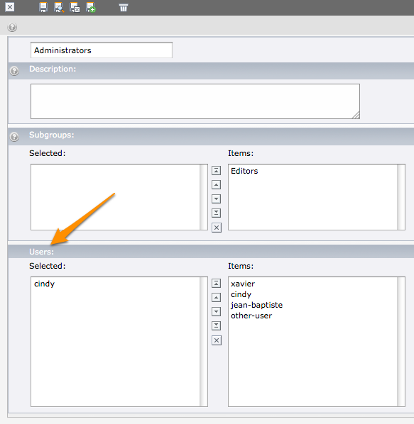

.. ==================================================
.. FOR YOUR INFORMATION
.. --------------------------------------------------
.. -*- coding: utf-8 -*- with BOM.

.. include:: ../Includes.txt

.. _introduction:

Introduction
============

.. _introduction-what-does-it-do:

What does it do?
----------------

This extension allows you to edit group membership for both your backend and frontend users from
within the backend or frontend group itself.

What you already know with TYPO3 is that when editing a user (either be_user or fe_user), you may
choose his group membership. With this extension, you can do the same from the group (either
be_group or fe_group) point of view.

.. _introduction-screenshots:

Screenshots
-----------

